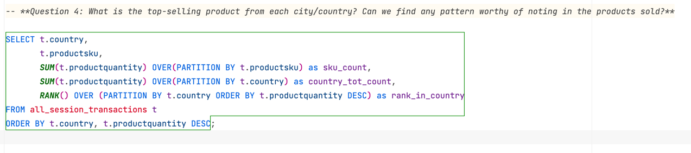
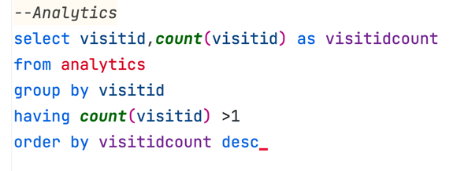
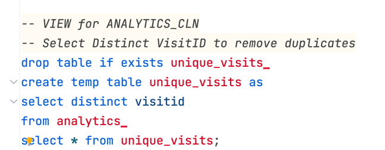
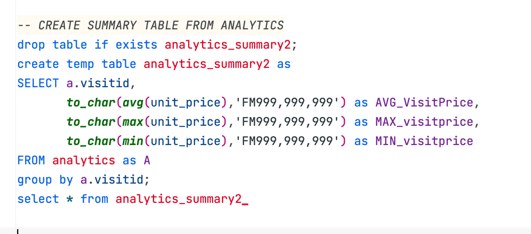
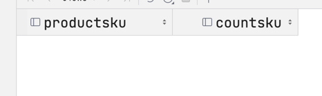
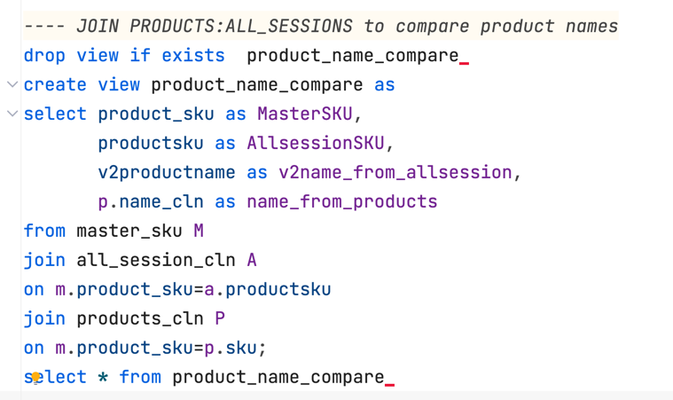
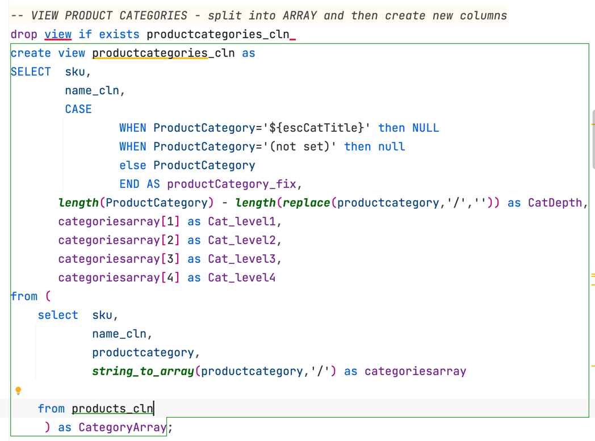
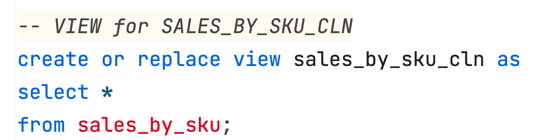
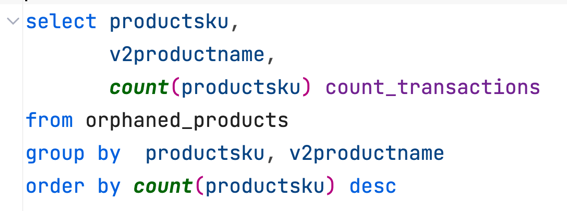

What issues will you address by cleaning the data?
1. looking for potential primary keys and any relationships in between Master data and transactions
2. Review MASTER DATA Tables first
   3. Products table - confirm duplications in SKU
   3. Analytics table - "id" columns should be unique. Attempted to create 'fullvisitorid' as PK, but there are duplicates
4. Before I undertake a significant cleaning effort, I want to know 'what is the END result or purpose of the analysis??'I dont want to waste my time remediating something that has no value. 

**Actions taken:**

## Part 1: Database Structure:
- [x] Primary keys: added primary key to [products], [sales_by_sku], [sales_report]
- [x] Field names: Changed the field names to all lower case. Double quotes in the field names were annoying - result from using MixEd CasE. 
- [x] Duplicates: Review primary key of master data for duplicates
  - [x] Remove duplicates in [all_sessions]
  - [x] Remove duplicate in primary key for [analytics]
- [x] Identify missing tables from schema
  - Product Category
  - E-commerce Transaction

- [ ] Views:
    - [x] Products_cln
    - [x] Analytics_cln
    - [x] Allsessions_cln
    - [x] Sales_report_cln
- [ ] Joins:
  - [x] [All_Sessions] to [Products] using Sku
  - [x] [products] to [sales_report] using sku 
  - [x] [analytics] to [all_sessions] using visitId
  - [x] [all_sessions] to [sales_report] using sku
  - [ ] Union of [salesbysku] and [sales_report]

- [ ] Master Data:
  - [x] Drop "name" from [all_sessions] table/view
  - [x] Product Category moved to [products]
  - [x] Confirm category structure and hierarchy
  
  
### Duplicates in primary keys for each table

   >SELECT sku,count(sku)\
FROM products\
GROUP BY by name,sku\
HAVING count(sku)>1

**PRODUCTS Table**  
* OK
* no duplicates in SKU
   > 

**ALL_SESSIONS Table**
* NOT OK
* VisitId has duplicates in 553 of 14,556
> 
> 

**ANALYTICS Table**
* NOT OK
* Visitid has duplicates. 
* Only ~148,000 are unique
* Analytics table contains very little meaningful information.
* Important data points are: 
  * visitid
  * unitprice
> 
> 
* Remove the duplicate VisitID
>

**ANALYTICS SUMMARY Table**: 
* created a summary table of the Analytics
  * VisitID
  * AVG unit price
  * MAX unit price
  * Min Unit price
> 
> 

**SALES BY SKU Table**
* OK
>
> 

## Master Data management: 

### Product Name
* [all session] and [products] both have product name.
* Product master data should reside in [products] not [all session]
* Compare descriptions to support hypothesis.
* Drop V2 name from all_session view (to avoid confusion)
>
> 

### Product Category:
* product category is a path
* confirm the total depth by counting the number of '/' (its 4)
> 

* Parse the Category path into categogry hierarchy
* CASE to clean up any of the junk categories first
* use a SUBQUERY to 
> 

### All Sessions: 
* All_Sesisons is a transaction table - each record represents an event defined by a point in time.
* no primary/unique key
* created primary key with concatenate of [visitid]-[date]-[time]
* select distinct primarykey 
  * elimiate ~ 1,000 duplicates
> 

## Part 2: Data Cleaning: 
- [ ] Cleaning: 
  - [ ] Products
    - Remove whitespaces from [name]
  - [ ] Sales_Report
    - Remove whitespaces from [name]
  - [ ] All_Sessions
    - Remove invalid or commentary from [city]. Replace with NULL
  - [x] Analytics
    - cast unitsold to number
  - 
### Mixed Case: Identify tables.fields that have mixed case

>SELECT table_name, column_name\
FROM information_schema.columns\
WHERE table_name = 'your_table_name'\
AND column_name <> LOWER(column_name);

### Trim leading/lagging Whitespace
* Removed leading whitespace
* confirmed if any lagging. 
>

## Views - create views for each Master Table
* Products
>

* Sales_Report:
> 

* Sales by SKU:
>

* All_Sessions:
> 

## JOINS
* Join [all_session] and [analytics] using visitID
* Join [all_session] and [products] using sku
* Join [products] and [sales_report] using sku
* Join [all_session] and [sales_report] using sku

## Orphaned Records & Ambiguous Data
Orphaned analytics:
* [all_sessions] and [analytics] as joined on VisitID. 
* Assumption: [all_sessions] should contain **all** transactions. 
* Orphaned records - Cases exist where there is a txn on [analytics] that does NOT appear in [all_sessions]
* For purpose of revenue capture, only include records where units sold >1

Orphaned Products (no record in Product Table): 
* [all_sessions] and [products] joined on 'sku'
* Assumption: all products listed in [all_transactions] should appears in [products]

>
> Count transactions of Orphaned Product: 
> 
> 

Orphaned SKU between Sales_Report and Sales_by_sku
* 462 sku on [sales by sku]
* 454 sku on [sales report]
* Which are the orphaned sku and are they material? 

>
> Results: 
> 