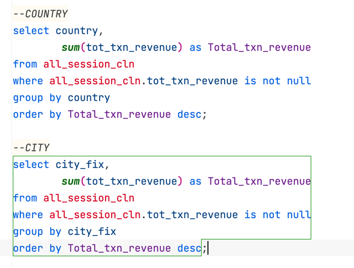
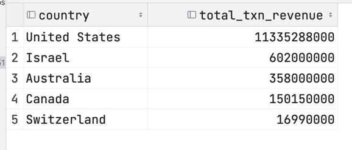

Answer the following questions and provide the SQL queries used to find the answer.

    
**Question 1: Which cities and countries have the highest level of transaction revenues on the site?**
* ALL_SESSIONS
  * pkey: sku
  * country
  * city
  * productprice
  * transaction revenue

SQL Queries:\

Answer:
>Top Countries: 
> 

>Top Cities

**Question 2: What is the average number of products ordered from visitors in each city and country?**
* average product count

SQL Queries:

Answer:

**Question 3: Is there any pattern in the types (product categories) of products ordered from visitors in each city and country?**

SQL Queries:

Answer:

**Question 4: What is the top-selling product from each city/country? Can we find any pattern worthy of noting in the products sold?**

SQL Queries:

Answer:

**Question 5: Can we summarize the impact of revenue generated from each city/country?**

SQL Queries:

Answer:

