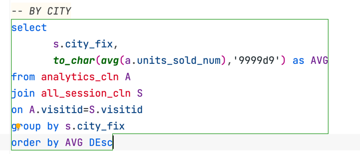
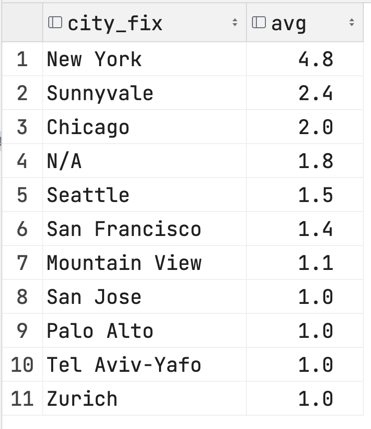
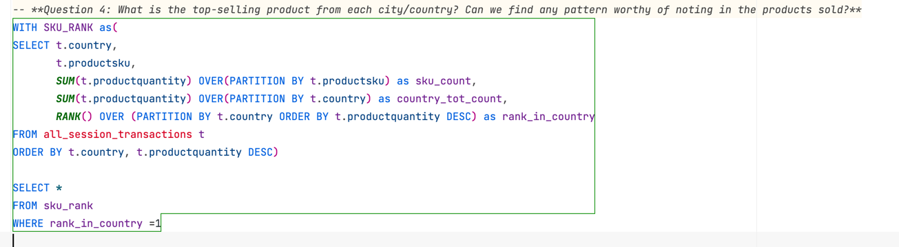
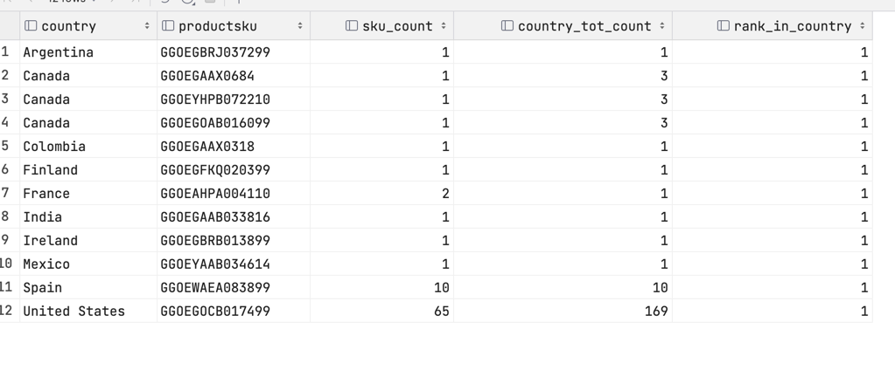
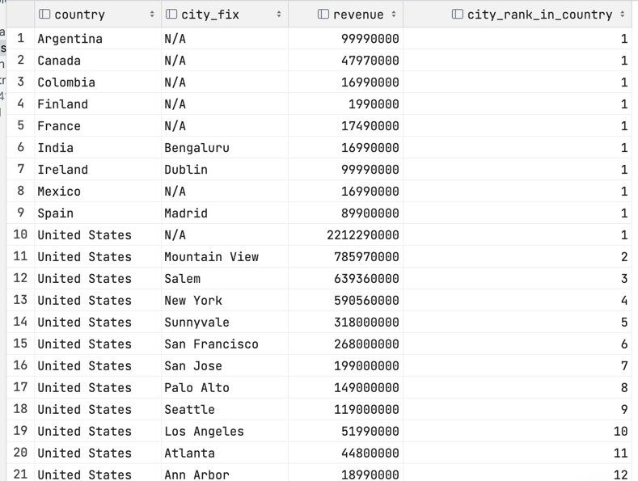

Answer the following questions and provide the SQL queries used to find the answer.

    
### Question 1: Which cities and countries have the highest level of transaction revenues on the site?**
* ALL_SESSIONS
  * pkey: sku
  * country
  * city
  * productprice
  * transaction revenue

**SQL Queries:**

**Answer:**
>Top Countries:
> 
> 

>Top Cities
> 
>

### Question 2: What is the average number of products ordered from visitors in each city and country?**
* average product/units country
* average product/units by city

**SQL Queries:**
> Average UNITS sold by country
> 
> 

> Average UNITY sold by City
> 
> 

**Answer:**

> Average Units by Country:
> 
> 

> Average Units by City: 
> 
> 

**Question 3: Is there any pattern in the types (product categories) of products ordered from visitors in each city and country?**

SQL Queries:\
Table: 
* [all_session_clean]
  * city 
  * country.
  * product Sku
* [product_categories_clean]
  * sku 
  * product categories

**Answer:**

* Trumpistan (USA) definitely had the most transactions.

> 

**Question 4: What is the top-selling product from each city/country? Can we find any pattern worthy of noting in the products sold?**

SQL Queries:\

> 

Answer:\

> 

**Question 5: Can we summarize the impact of revenue generated from each city/country?**

SQL Queries:

> 

Answer:

> 

