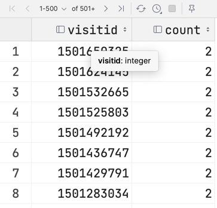
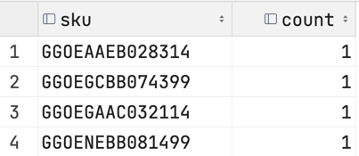
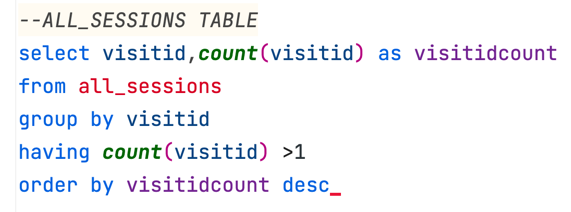
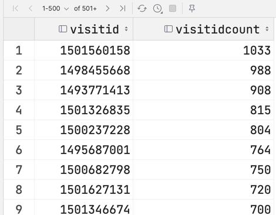
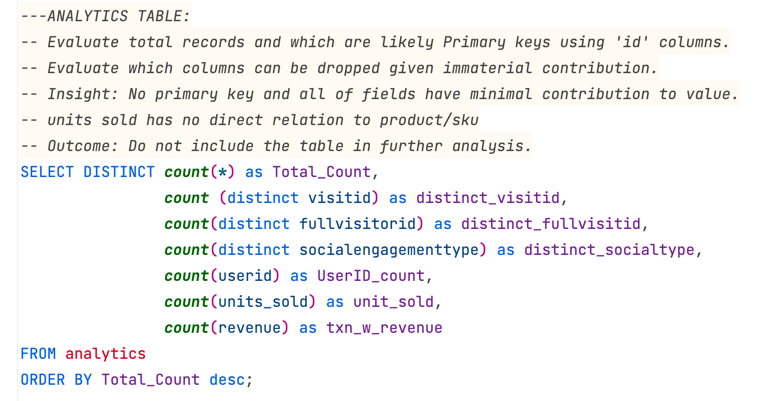
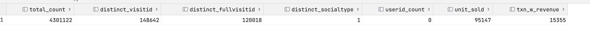
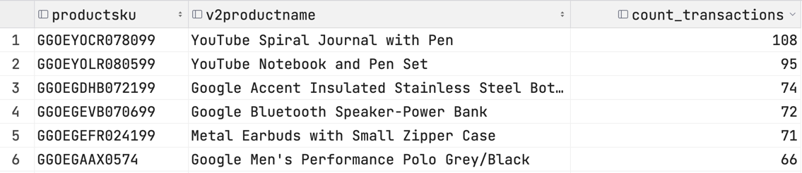

## Risks and Issues:
- duplication of 'important' data points
- omission of data points
- count vs sum
- 

QA Process:
Describe your QA process and include the SQL queries used to execute it.
1. list or identify the key data points that are invovled in an analysis. 
   2. a data dictionary of sorts
3. visualize what the resulting data table 'should look like' beforehand
4. start with pseudo-code 
4. break large queries down inot smaller ones to verify counts/sum

### Duplicates in primary keys for each table

   >SELECT sku,count(sku)\
FROM products\
GROUP BY by name,sku\
HAVING count(sku)>1

**PRODUCTS Table**  
* OK
* no duplicates in SKU
>

> 

**ALL_SESSIONS Table**
* NOT OK
* VisitId has duplicates in 553 of 14,556
> 

> 

**ANALYTICS Table**
* NOT OK
* Visitid has duplicates. 
* Only ~148,000 are unique
* Analytics table contains very little meaningful information.
* Important data points are: 
  * visitid
  * unitprice
> 
> > 

* Identify other potential primary keys or have material value
>
* 
>Conclusion - most of the table is meaningless as the values are either duplicated or predominantly null.
> 
* Remove the duplicate VisitID
>

## Orphaned Records & Ambiguous Data
Orphaned analytics:
* [all_sessions] and [analytics] as joined on VisitID. 
* Assumption: [all_sessions] should contain **all** transactions. 
* Orphaned records - Cases exist where there is a txn on [analytics] that does NOT appear in [all_sessions]
* For purpose of revenue capture, only include records where units sold >1
> 

Orphaned Products (no record in Product Table): 
* [all_sessions] and [products] joined on 'sku'
* Assumption: all products listed in [all_transactions] should appears in [products]

> 
> Count transactions of Orphaned Product: 
> 
> 

Orphaned SKU between Sales_Report and Sales_by_sku
* 462 sku on [sales by sku]
* 454 sku on [sales report]
* Which are the orphaned sku and are they material? 

>

> Results: 
> 