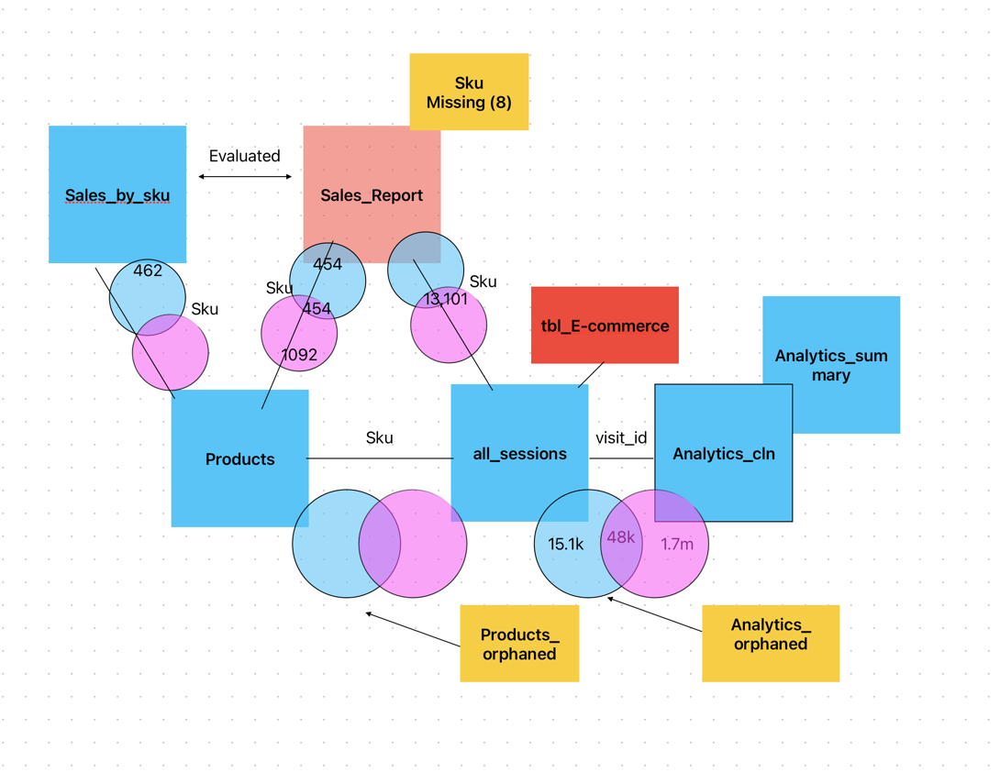

# Final-Project-Transforming-and-Analyzing-Data-with-SQL

## Project/Goals
(fill in your description and goals here)

## Process:
1. [Schema and Master Data Review](https://github.com/j-lepard/LHL-SQL_Project/blob/8787467a2a8bf9ac972472815ad9b794971721ae/02.cleaning_data.md)
2. [Initial inquiries from the Business](https://github.com/j-lepard/LHL-SQL_Project/blob/8787467a2a8bf9ac972472815ad9b794971721ae/03.starting_with_questions.md)
3. [Supplementary questions](https://github.com/j-lepard/LHL-SQL_Project/blob/8787467a2a8bf9ac972472815ad9b794971721ae/04.starting_with_data.md)
4. [Quality Assurance](https://github.com/j-lepard/LHL-SQL_Project/blob/8787467a2a8bf9ac972472815ad9b794971721ae/05.QA.md)
5. Iterate, Iterate ...

## Results
- The business results have been captured in #2 of the Process section. 
- Results from a 'personal' development perspective included: 
  - identified pitfalls of over-complicating data sets!
  - validated my approach to reviewing data sets
  - became reasonably proficient at writing in markdown (something I've always wanted)
  - 
## Challenges 
1. Reverse engineering a database with no context on business application. 
2. Determining the wheat from the chaff (what is junk vs. important)
3. Evaluating orphaned records and the 'source of truth'
4. Keeping track of 'what am I working on'

## Future Goals
* re-engineer the data into proper master data. 
  * example: 
    * build the e-commerce table
    * build country, city table
* move all the supporting .png files into their own sub directory. 
* actually do some meaningful queries! 
* A 'real' ERD... not this temporary mind jumble. 
